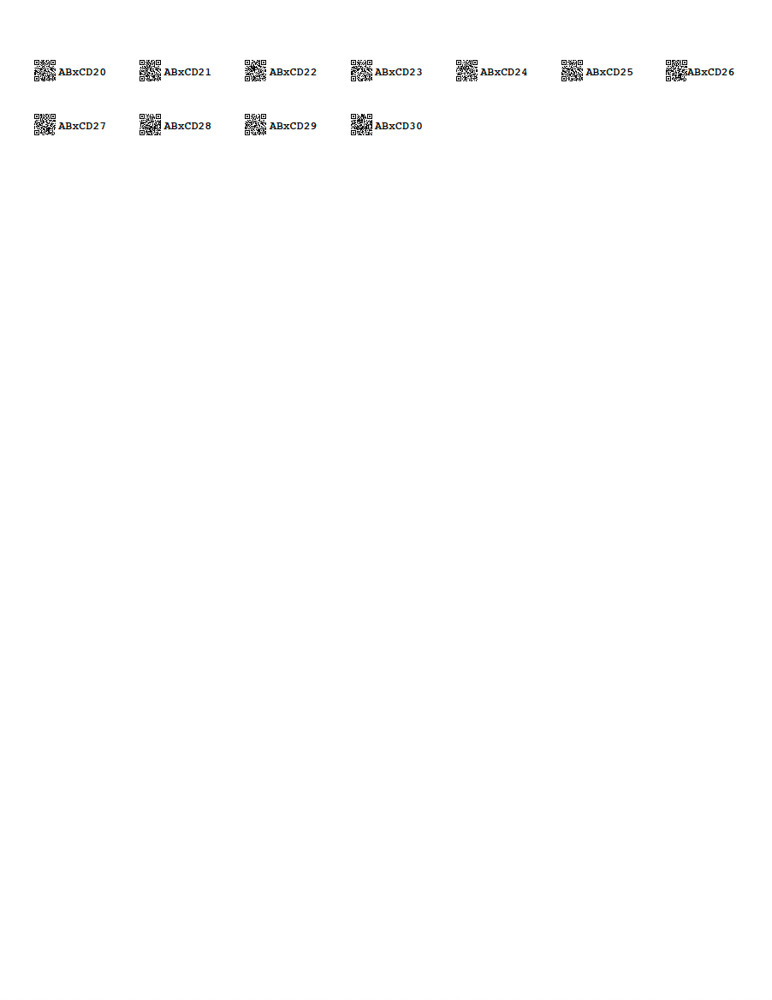

# flowcamr
Utilities for FlowCam Data

<!-- badges: start -->
[](https://lifecycle.r-lib.org/articles/stages.html#experimental)
[](https://github.com/DICELab-NCSU/flowcamr/actions/workflows/R-CMD-check.yml)
[](https://CRAN.R-project.org/package=flowcamr)
<!-- badges: end -->

This package provides tools for working with particle and imagery data produced on a [FlowCam](https://www.fluidimaging.com/products/flowcam-8000).

## Getting started
This package is currently in development, and is hosted on GitHub. To install,
```{r}
# install.packages("remotes")
remotes::install_github("DICELab-NCSU/flowcamr")
library("flowcamr")
```

## Functionality
### 1. Harvesting metadata
- `get_flowcam_meta` operates on 'Run Summaries' .csv files that have been exported from Visual Spreadsheet. Metadata are gathered across all files supplied,
summarized into a data frame, and optionally exported to a .csv summary.

### 2. Generating barcodes
- `mk_barcodes` generates a PDF of QR-style barcodes that can be printed on sticky labels for robust, automated sample identification. Additional data can be included in the barcode that is not displayed in the human-readable text using the `experiment` argument.

```
mk_barcodes("my_barcodes.pdf", experiment = "gladiators", resident = "AB", invader = "CD", reps = 20:30)
```


## Contributing
We welcome bug reports, feature requests, and contributed code.
